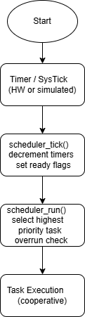

# Lightweight Embedded Scheduler

**Author:** Vivek Patel  
**Language:** C  
**Type:** Cooperative Scheduler (RTOS Alternative)  
**Target:** Embedded / Host-based systems  

This project implements a lightweight, cooperative task scheduler designed
for resource-constrained embedded systems where a full RTOS is not required.


# Lightweight Embedded Scheduler

A lightweight, cooperative task scheduler written in C for
resource-constrained embedded systems where a full RTOS is not required.

This project demonstrates how periodic task scheduling, priority handling,
and defensive design can be implemented without dynamic memory or OS support.

---

## Why This Scheduler?

In many embedded products:
- A full RTOS is unnecessary or too heavy
- Legacy firmware uses a single `while(1)` loop
- Deterministic behavior is more important than preemption

This scheduler provides a **simple, predictable alternative** that fits
well in small to mid-scale embedded systems.

---

## Key Features

- Cooperative scheduling (no preemption)
- Fixed time tick (configurable)
- Periodic task execution
- Priority-based task selection
- Overrun protection
- No dynamic memory allocation
- Platform independent (MCU or host)

---

## Architecture Overview

- `scheduler_tick()`  
  Updates internal timing and marks tasks as ready  
  (typically called from a timer ISR)

- `scheduler_run()`  
  Selects and executes **one ready task per cycle**  
  based on priority

- Tasks are re-armed automatically after execution

This separation keeps timing logic fast and execution logic deterministic.

---

## Task Model

Each task is defined by:
- Function pointer
- Period (milliseconds)
- Priority (lower value = higher priority)
- Internal state (ready / running)

Only **one task executes per scheduler cycle**, preventing starvation
and maintaining predictable behavior.

---

## Public API

```c
void scheduler_init(void);

int scheduler_add_task(void (*task_fn)(void),
                       uint32_t period_ms,
                       uint8_t priority);

void scheduler_tick(void);
void scheduler_run(void);


## Architecture




